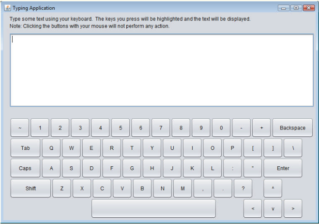

# 1220-professor-de-digitacao
Digitar rápida e corretamente é uma habilidade essencial para trabalhar de forma eficaz com computadores e a internet. Neste exercício, você construirá um aplicativo GUI que
pode ajudar os usuários a aprender a digitar corretamente sem olhar para o teclado. O aplicativo deve exibir um teclado virtual (Figura
12.50) e permitir que o usuário veja o que ele está digitando na tela sem olhar para o teclado real. Use JButtons para representar as
teclas. À medida que o usuário pressiona cada tecla, o aplicativo destaca o JButton correspondente na GUI e adiciona o caractere a uma
JTextArea que mostra o que o usuário digitou até agora. [Dica: para destacar um JButton, use o método setBackground para
mudar a cor de fundo. Quando a tecla é liberada, redefina a cor original do fundo. Você pode obter a cor original de fundo do JButton
com o método getBackground antes de mudar a cor.]
Você pode testar seu programa digitando um pangrama — uma frase que contém todas as letras do alfabeto pelo menos uma vez —
como “The quick brown fox jumps over a lazy dog” ou, em português, “Um pequeno jabuti xereta viu dez cegonhas felizes”. Você pode encontrar outros pangramas na web.
Para tornar o programa mais interessante, monitore a precisão do usuário. Você pode fazer com que o usuário digite frases específicas
que você pré-armazenou no seu programa e que você exibe na tela acima do teclado virtual. Pode-se monitorar quantos pressionamentos de
tecla o usuário digita corretamente e quantos são digitados incorretamente. Pode-se também monitorar com quais teclas o usuário tem dificuldade e exibir um relatório mostrando essas teclas.

